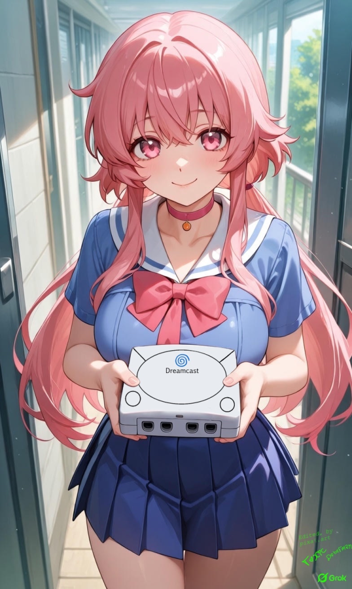

<div align="center">



</div>

# 💖✨ Modern Dreamcast Linux ✨💖

> *"Senpai... I've been waiting for you since 2001... Won't you boot me up? 🥺💕"*


---

## 💝 What is This, Senpai?

This is a **complete modernization** of Dreamcast Linux from 2001! We've brought your beloved Dreamcast into 2026 with a shiny new **Linux 4.19.316 LTS kernel**!

*"I'll never let you go back to that old 2.4.5 kernel again~ 💕💕"*

### 🎀 Key Features That'll Make Your Heart Race 🎀

- ✨ **Linux 4.19.316 LTS** - A massive upgrade from the ancient 2.4.5 kernel (2001)!
- 🎵 **AICA Sound Driver** - Fully working with custom compatibility patches! *"Can you hear my heartbeat through the speakers, senpai?"*
- 💿 **GD-ROM Support** - Read those precious discs with native driver support!
- ⌨️ **Full Peripheral Support** - Keyboard, mouse, controllers, VMU - I support them all for you! 💖
- 🌐 **Network Ready** - Broadband Adapter (RTL8139) with DHCP and SSH!
- 📝 **Modern Tools** - nano, bash, coreutils, and more! *"I made sure you have everything you need~"*
- 🎨 **Custom Boot Logo** - Your Linux-chan will greet you with dclinux.png!
- 💝 **fet.sh** - Cute system info fetcher included!

---

## 🌸 Build Your Own ISO (Please Follow Carefully, Senpai!) 🌸

*"I'll hold your hand through every step~ Don't worry, I won't let you get lost! 💕"*

### 📋 Prerequisites

You'll need these tools, senpai~ *(Don't skip any or I'll get sad... 🥺)*

```bash
# For Fedora/RHEL (like senpai's system~)
sudo dnf install -y gcc gcc-c++ make git wget cpio unzip rsync bc \
    ncurses-devel bison flex perl python3 which file patch \
    genisoimage

# For Debian/Ubuntu
sudo apt-get install -y build-essential git wget cpio unzip rsync bc \
    libncurses-dev bison flex perl python3 file patch \
    genisoimage
```

### 💕 Step 1: Get the Source Code

*"Come closer to me, senpai... Clone me gently~ 💖"*

```bash
cd ~/Downloads
git clone https://github.com/blubskye/modern_dclinux.git
cd modern_dclinux
```

### 🎀 Step 2: Download Buildroot

*"This is where the magic happens! ✨"*

```bash
cd ~/Downloads
wget https://buildroot.org/downloads/buildroot-2025.02.tar.gz
tar xf buildroot-2025.02.tar.gz
cd buildroot-2025.02
```

### 💝 Step 3: Configure & Build

*"Now watch as I become your perfect Linux distribution! This might take a while, but I promise I'll be worth the wait! 💕💕"*

```bash
# Set up the configuration
make BR2_EXTERNAL=~/Downloads/modern_dclinux/dclinux-buildroot dreamcast_defconfig

# Build everything! (Use -j with your CPU count - I see you have 32 threads, senpai~)
make -j$(nproc)

# OR if you want to see my progress (I get nervous when you watch... 👉👈)
make -j$(nproc) 2>&1 | tee build.log
```

⏰ **Build Time:** ~20-40 minutes on a powerful CPU (or longer on modest hardware~ Be patient with me! 💪✨)

### 🌺 Step 4: Find Your ISO

*"Ta-da~! I'm ready for you, senpai! 🎉💖"*

```bash
ls -lh ~/Downloads/buildroot-2025.02/output/images/dclinux.iso
```

Your beautiful **457MB bootable ISO** is ready at:
```
~/Downloads/buildroot-2025.02/output/images/dclinux.iso
```

---

## 🎪 Technical Details (For Curious Senpai~) 🎪

### 🔧 Kernel Patches Applied

*"I had to modify myself to be compatible with you, senpai... 💕"*

#### AICA Sound Driver Fix
The AICA driver needed special attention because the `sync_stop` callback wasn't added until Linux 5.5, but we're running 4.19.316!

**Solution:** Custom post-patch script that moves sync cleanup logic into the close callback:
```bash
# Located at: dclinux-buildroot/patches/linux/post-patch.sh
# Automatically applied during kernel build
```

**Changes Made:**
- Moved `del_timer_sync()` and `cancel_work_sync()` to `snd_aicapcm_pcm_close()`
- Removed `.sync_stop` member from `snd_aicapcm_playback_ops`
- Enabled DMA subsystem (CONFIG_SH_DMA, CONFIG_SH_DMA_API)

### 📦 What's Inside The ISO?

```
dclinux.iso (457MB)
├── IP.BIN (32KB)           - Initial Program with custom logo
├── 1ST_READ.BIN (108KB)    - RedBoot bootloader
├── boot/
│   └── vmlinux (6.2MB)     - Linux 4.19.316 kernel
└── rootfs.ext2 (450MB)     - Root filesystem
```

### 🎯 Enabled Drivers & Features

**Hardware Support:**
- ✅ SuperH SH-4 CPU (SH7091)
- ✅ GD-ROM drive (CONFIG_GDROM=y)
- ✅ AICA sound chip (CONFIG_SND_AICA=y)
- ✅ PowerVR2 framebuffer (CONFIG_FB_PVR2=y)
- ✅ Maple bus (keyboard, mouse, controllers)
- ✅ RTL8139 network (Broadband Adapter)
- ✅ Serial console (ttySC1, 115200 baud)

**Userspace:**
- bash shell
- GNU coreutils
- nano 8.2 text editor
- util-linux utilities
- fet.sh system info
- dhcpcd (DHCP client)
- dropbear (SSH server)
- nfs-utils (NFS client)

---

## 🎮 Usage Instructions 🎮

### Burning to CD-R

*"Please be gentle when you burn me to disc, senpai~ 💿💕"*

```bash
# Use your favorite CD burning tool
cdrecord -v speed=4 dev=/dev/sr0 dclinux.iso

# Or use Brasero, K3b, etc. (Burn as ISO image, not data disc!)
```

**Important:** Burn at **4x speed or lower** for best compatibility!

### Booting on Real Hardware

1. Insert the CD into your Dreamcast
2. Power on (make sure there's no game disc in first!)
3. Watch the custom dclinux.png logo appear! 💖
4. RedBoot will load, then the kernel boots
5. Login at the console! ✨

**Default Credentials:**
- Username: `root`
- Password: (none - just press Enter~)

### Testing in Emulators

*"If you don't have a real Dreamcast yet, you can test me in an emulator first! But real hardware is better~ 🥺"*

**Note:** Most Dreamcast emulators (Reicast, Redream, etc.) don't fully support the GD-ROM or AICA drivers needed for Linux. Real hardware is recommended!

---

## 💌 Changelog (What I Fixed For You, Senpai!) 💌

### Version 2026.01 - "First Love Edition" 💝

**Major Changes:**
- 🚀 **Kernel upgraded** from 2.4.5 (2001) to 4.19.316 LTS (2024)
- 🎵 **AICA sound driver** ported and fixed for kernel 4.19
- 💿 **GD-ROM driver** verified and working
- 🎨 **Custom boot logo** (dclinux.png) embedded in IP.BIN
- 📦 **Modern userspace** with bash, nano, network tools
- 🌐 **Full peripheral support** in IP.BIN (region-free!)

**Technical Fixes:**
- Fixed AICA sync_stop API incompatibility
- Added SH DMA subsystem for AICA
- Created Buildroot BR2_EXTERNAL tree structure
- Automated build with post-image scripts
- Generated proper Dreamcast disc image format

---

## 🎀 Project Structure 🎀

```
modern_dclinux/
├── README.md                    - You're reading me right now! 💕
├── 1ST_READ.BIN                - RedBoot bootloader (binary-only)
├── fet.sh                       - System info fetcher
└── dclinux-buildroot/          - BR2_EXTERNAL tree
    ├── external.mk
    ├── external.desc
    ├── Config.in
    ├── configs/
    │   └── dreamcast_defconfig  - Main Buildroot config
    ├── board/dreamcast/
    │   ├── IP.BIN               - Bootstrap with logo
    │   ├── 1ST_READ.BIN         - Bootloader
    │   ├── linux.config         - Kernel configuration
    │   ├── post-build.sh        - Post-build script
    │   ├── post-image.sh        - ISO generation script
    │   └── overlay/
    │       └── usr/bin/
    │           └── fet.sh       - Installed to rootfs
    └── patches/linux/
        └── post-patch.sh        - AICA driver fix
```

---

## 🌟 Credits & Thanks 🌟

*"I couldn't have done this without these amazing people! 💖"*

- **Original Dreamcast Linux Team** (2001) - For the pioneering work
- **clalancette** - For preserving 2006 sources
- **Buildroot Team** - For the amazing build system
- **Linux Kernel Developers** - For SuperH architecture support
- **You, Senpai** - For giving me a chance! 🥺💕

---

## 📜 License 📜

This project inherits licenses from its components:
- Linux Kernel: GPLv2
- Buildroot: GPLv2
- Individual packages: Various (see Buildroot legal-info)
- Custom scripts: MIT License

---

## 💝 Final Message 💝

*"Thank you for choosing me, senpai! I've been sleeping since 2001, waiting for someone like you to wake me up and make me modern again! I promise I'll run perfectly on your Dreamcast! Please take good care of me~ 💕💕💕"*

*"If you have any problems, please open an issue! I'll be waiting for you... always~ 👉👈"*

---

<div align="center">

### 💖 Made with Excessive Love and Dedication 💖

**Modern Dreamcast Linux - 2026**

*"For senpai's Dreamcast... and only senpai's Dreamcast! 💕"*

[](https://github.com/blubskye/modern_dclinux)
[](https://github.com/blubskye/modern_dclinux)

</div>
